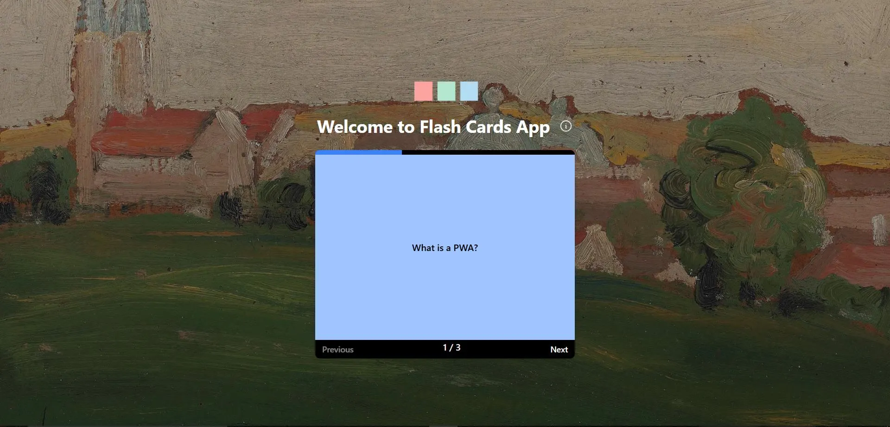
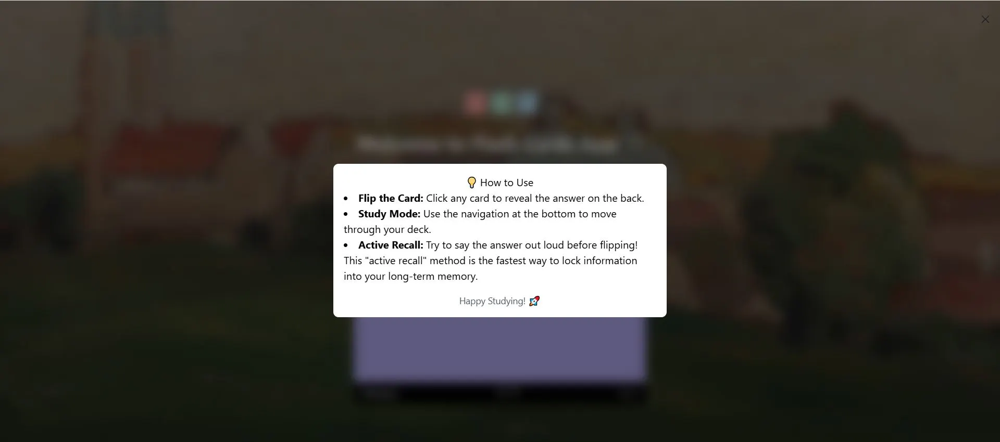

  
<h1 id='top'>Flash Cards: Full-Stack PWA Learning Platform</h1>




Flash Cards is a full-stack application designed to help users master new concepts through interactive 3D flashcards. It features a React-based Progressive Web App (PWA) frontend and a robust Node.js/Express backend API.

The app includes a real-time progress tracking system with a dynamic visual progress bar.

## Project Architecture
### This project is organized as a monorepo, ensuring a unified workflow for both the client and server:

* **/frontend:** React 18 application powered by Vite, Redux Toolkit, and Tailwind CSS.

* **/backend:** RESTful API server built with Node.js and Express.

## Core Tech Stack
* **Frontend:** React, Redux Toolkit (RTK), Axios, Tailwind CSS.
* **Backend:** Node.js, Express, (Auth & DB Logic).
* **Quality & Style:** ESLint (Flat Config), Prettier (Strict 4-tab/No-Semi), Vite.
* **Performance:** Redux Persist for offline-ready state retention.

## Quick Start

### Clone the repository
```bash
git clone https://github.com/manevardazaryan1/flash-cards.git
```

### Setup the Backend
```bash
cd backend
npm install
# Configure your .env (See /backend/README.md)
npm run dev
```

### Setup the Frontend
```bash
cd ../frontend
npm install
# Configure VITE_API_URL in .env (See /frontend/README.md)
npm run dev
```

## Accessibility (a11y) Standards

* **Focus Management:** Modals trap focus and return it correctly upon closing.
* **Live Regions:** aria-live="polite" is used for pagination and card updates so screen readers announce changes.
* **Semantic HTML:** Usage of semantic tags instead of generic div tags for better screen reader navigation.

## Architectural Patterns: Compound Components
To ensure the UI is flexible and declarative, the core components (FlashCard, Modal, Pagination) follow the Compound Component Pattern. This allows for a highly readable syntax and prevents "Prop Drilling."

[Tap to Top ⬆](#top)

